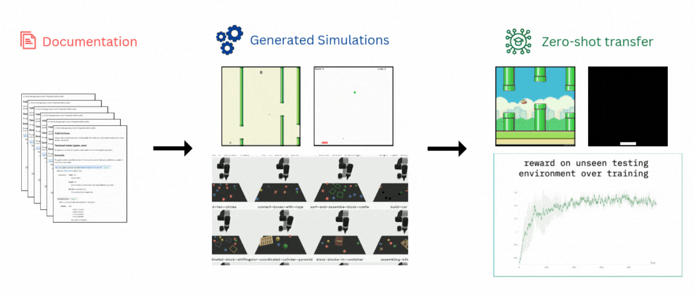

# FactorSim: Generative Simulation via Factorized Representation

**NeurIPS 2024**

[](https://cs.stanford.edu/~sunfanyun/factorsim/)
[]()

[Fan-Yun Sun](https://sunfanyun.com/),
[Harini S I](https://harini-si.github.io/),
[Alex Zook](https://scholar.google.com/citations?user=2nA9bVMAAAAJ&hl=en),
[Jonathan Tremblay](https://scholar.google.com/citations?hl=en&user=zeS5UJEAAAAJ),
[Logan Cross](https://scholar.google.com/citations?hl=en&user=sTCyNPIAAAAJ),
[Jiajun Wu](https://scholar.google.com/citations?user=2efgcS0AAAAJ&hl=en),
[Nick Haber](https://scholar.google.com/citations?user=euNCoVYAAAAJ&hl=en)





### Simulation Generation
Refer to the README under the directory `factorsim`.
```
$ cd factorsim
$ ./go.sh GAME_NAME
```

### Zero-shot transfer experiments 
Refer to [rl_training/rl_train.sh](rl_training/rl_train.sh).

To train RL policies on the PLE environments ("ground-truth" environments used in the paper), run 
```
$ cd rl_training
$ ./rl_train.sh pong ppo gt --train_on_ple
```

### Miscellaneous
To export video trajectory of a policy 
````
$ cd rl_training
$ python -m utils.export_video pong
````

## Acknowledgement
- [PLE: A Reinforcement Learning Environment](https://pygame-learning-environment.readthedocs.io/en/latest/)
- [RLLib](https://docs.ray.io/en/latest/rllib/index.html)
